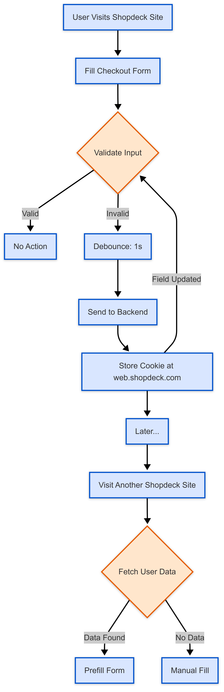

# Cross-Domain User Details Sharing

This document explains the technical implementation of the **Cross-Domain User Details Sharing** feature.

---

## What are we doing? Who will this feature work for?

If a customer visits any Shopdeck merchant website and begins their checkout journey, we will start capturing **valid user details** as soon as they begin entering information into the fields.

### Example 1:
Suppose a user arrives at the checkout page and starts filling in their phone number.  
Once they complete entering a **valid 10-digit number** (passing our internal validation), we will **store** this number (storage mechanism explained below).  
If the user later updates the phone number, we will **update** the centralized data accordingly.

### Example 2:
Let's consider a slightly more complex scenario involving address fields.  
We have four primary fields for the address:
- Name
- House No. / Building Name
- Road Name
- Pincode

Suppose a customer begins filling the **Road Name** field, which requires a minimum of **20 English characters** to pass validation.  
If the user initially enters:

> `Buildwell height`  
(this input fails validation as it’s less than 20 characters)

We will **not store** this data anywhere.

If the user later updates it to:

> `Buildwell height, Kundanhalli Main Gate, Gali Number 2`  
(satisfying the validation), then we will **store** this updated address into our centralized storage.

---

## How we Optimize this — Debouncing

To further improve performance and user experience, we have implemented **debouncing**.

Debouncing is like telling someone:  
> "Wait a second before you act, in case I change my mind."

It is used when actions happen repeatedly in quick succession (like typing or clicking), but you want to **react only once**, after a brief pause.

We apply a **1-second debounce** after user input.  
This ensures:
- Fewer API calls to the server
- A smoother and more seamless user experience

---

## How and Where are we Storing the Data?

Here’s how it works:
- When the user fills any field that passes validation, we **call our backend service**.
- This service **stores the user’s details** in a **centralized/common domain**, e.g., `web.shopdeck.com`, in the form of a **cookie**.
- If the same customer later opens **any other Shopdeck merchant website** (even if they have never visited it before), we will **call our backend service** again and **try to fetch** the user details from the centralized domain if an ID exists.

This allows **cross-domain data sharing** across all Shopdeck merchant sites.

> **Note:**  
> This sharing is limited to the **same browser only**.

---

## What are we actually achieving with this?

Until now, this documentation mainly covered how we store user data — but let’s now explain **what value** we are getting from this implementation.

When a user fills in their details on any Shopdeck merchant website, we store their validated inputs in a **common domain cookie** (at `web.shopdeck.com`) behind the scenes.

Now, imagine the same customer lands on a **completely new Shopdeck merchant website** — a site they have **never visited before**.  
As they start their checkout journey, we silently attempt to **retrieve** their saved details from the **common domain**.

If we successfully find the data:
- We will **prefill** the user’s checkout fields automatically (e.g., phone number, address).
- This significantly **reduces the time and friction** required for the user to complete the checkout form.

As a result, we can expect a measurable improvement in important funnel metrics like:
- `mobile_number_filled`
- `address_filled` rates

In simple terms:  
We are making the checkout process **faster**, **smoother**, and **more convenient** for returning customers — even if they are visiting a Shopdeck store for the first time — by smartly using the power of **cross-domain user data sharing**.

---

# Data Storage for Tracking and Analysis

To ensure a seamless user experience and track user details across different Shopdeck merchant websites, we’ve implemented two key tables for storing and managing user data.

## 1. `Sd_sso_user_details_assigned`

This table is used to store user details when the user fills in a form field and the input passes the validation criteria.

### What data is stored?
- **Common Fields:**
  - `C0` (Common to all events) - This identifier ensures that the data is consistent across different events and actions.
- **User Details Fields:**
  - `user_detail_type` (e.g., `mobile_number`, `road_name`, `pincode`) – The type of user detail that was filled in.
  - The table stores validated user details like mobile number, road name, or pincode once the user has successfully entered the information.

### When does data get stored?
- Data is saved in this table when the user successfully enters information into a field, and the input is validated (e.g., a valid 10-digit mobile number, a correctly formatted road name, etc.).
- Each time a valid user detail is entered, it is captured and stored for future reference.

---

## 2. `Sd_sso_user_details_exists`

This table helps us quickly check if a user has already provided data on any Shopdeck merchant website. When a user lands on a new website and starts the checkout process, we check this table to see if the user’s details are already available in our common domain.

### What data is stored?
- **Common Fields:**
  - `C0` (Common to all events) - Identifies and links events related to the same user.
- **User Details Fields:**
  - `user_detail_type` (e.g., `mobile_number`, `road_name`, `pincode`) – Specifies the type of user detail being checked.
  - This table contains the user’s validated details that were previously stored.

### When does this data get triggered?
- This table is queried when a user visits a new Shopdeck merchant website and starts the checkout journey.
- If we find that the user has previously filled in their details on another Shopdeck merchant website (stored in the common domain), the details are fetched and prefilled into the checkout form for that user.

---

## Summary of Tables and Data Flow

| **Table**                        | **Trigger**                                                        | **Stored Data**                                                 |
|-----------------------------------|--------------------------------------------------------------------|-----------------------------------------------------------------|
| `Sd_sso_user_details_assigned`    | When the user enters and validates a field in the checkout form.  | User details: `mobile_number`, `road_name`, `pincode` (Validated) |
| `Sd_sso_user_details_exists`      | When the user lands on a checkout page and has previously filled data. | Fetched user details from common domain: `mobile_number`, `road_name`, `pincode` |

---

## Purpose and Benefits:
- **Cross-Site User Experience**: This data storage system allows us to prefill user details across various Shopdeck merchant websites, providing a seamless checkout experience for returning customers.
- **Faster Checkout Process**: By tracking and storing validated user details, we reduce the need for customers to re-enter the same information multiple times, resulting in quicker checkouts.
- **Data Consistency**: These tables ensure that user details are consistently stored and updated, preventing discrepancies across multiple websites.

---

This system of storing and retrieving user data not only improves the checkout flow but also enhances tracking and analysis of user behavior, helping us optimize the user experience over time.

---

    
